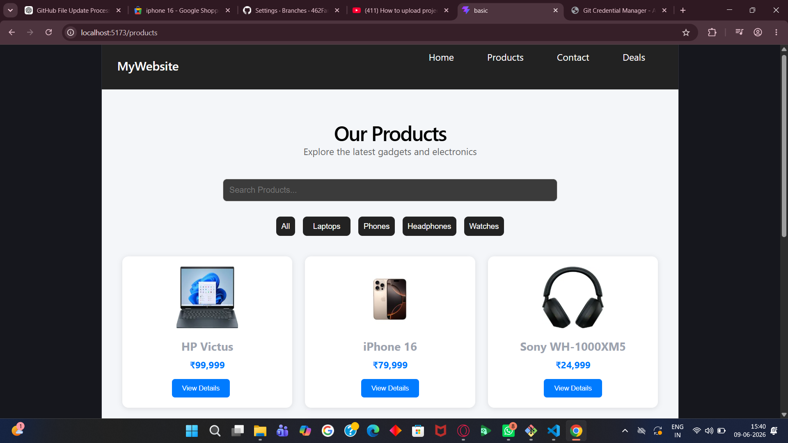
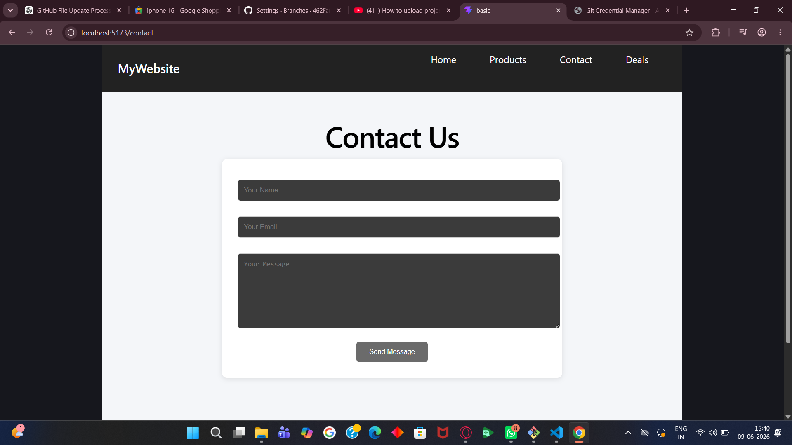
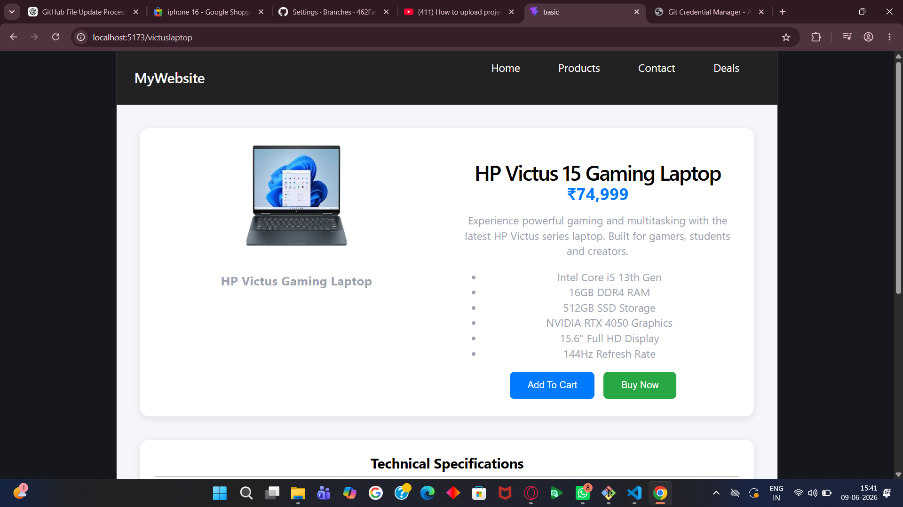

# Electronic Web Assignment

## Description

Electronic Web Assignment is a React-based electronics shopping website developed using React and Vite. The website allows users to browse products, view deals, explore product details, and access contact information through a clean and user-friendly interface.

## Features

* Home Page
* Products Page
* Deals Page
* Contact Page
* Victus Product Page

## Technologies Used

* React
* Vite
* JavaScript
* HTML
* CSS

## Screenshots

### Home Page

### Products Page

### Deals Page

### Contact Page

### Victus Product Page

## Author

Farhan Shaikh
.
